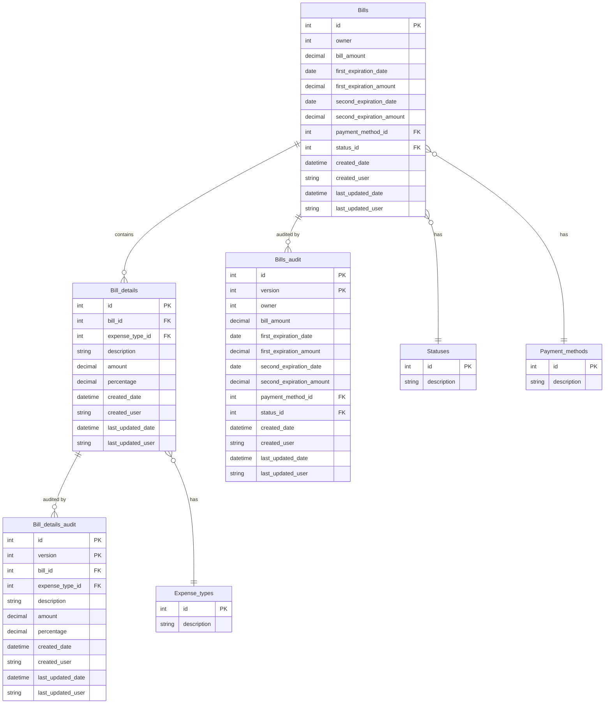

<div> 
  <h1 align="center">
     ✦ Boletas y Cobros - Back-End ✦
  </h1>
</div>

<div align="left">
    <h2>👥 Integrantes:</h2>

| Nombre                      |
| --------------------------- |
| Almeida Misael Ezequias     |
| Cuello Cristian Santiago    |
| Davis Alexis Federico       |
| Gomez Valore Eugenio        |
| Golazo Federico Tomas       |
| Leon Llanos Simon Francisco |
| Martinez Schroeder Andres   |
| Olivera Agustin Ivan        |
| Zunino Luca                 |

</div>

## ✍Descripción

Este proyecto contiene el back-end para el sistema de Boletas y Cobros, compuesto por dos microservicios desarrollados con **Spring Boot** y gestionados con **Eureka**.

## Instalacion

### Requisitos previos

- Java 17
- Maven
- Spring Boot
- Eureka Server

## Uso

Los microservicios proporcionan endpoints REST para la emisión de boletas y gestión de cobros. Puedes acceder a la documentación de los endpoints en cada microservicio:

Boletas Microservice:

Cobros Microservice:

## Microservicios

Boletas Microservice
Gestión de la emisión de boletas. Los endpoints permiten la creación, consulta y actualización de boletas.

Cobros Microservice
Gestión de los cobros de boletas. Los endpoints permiten la consulta de estados de cobro y la confirmación de pagos.

## Diagrama de base de datos



## Tecnologias

- Java 17
- Spring Boot
  - Spring Web
  - Spring Data JPA
  - Eureka Discovery Client
- Maven

<div>
  <h1 align="center">
     ✦ Boletas y Cobros - Front-End ✦
  </h1>
</div>

## ✍Descripción

El front-end proporciona una interfaz amigable que interactúa con los microservicios de boletas y cobros. Los usuarios pueden visualizar boletas, gestionar pagos y visualizar el estado de las transacciones.

## Instalacion

### Requisitos previos

- Node.js (v16+)
- Angular CLI

## Uso

En la interfaz podrás:

- Visualizar boletas.
- Verificar el estado de una boleta.
- Gestionar pagos de manera interactiva.

## Captura de Pantalla

Imagen de ejemplo de como se vizualizaria:


## Tecnologias

- Angular 18
- Bootstrap
- TypeScript
- HTML5/CSS3

```

```
